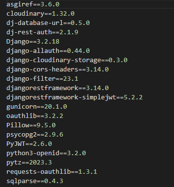

# Introduction 

Bike bros is intended to be a site for Motorcycle enthusiasts to come together. The site allows users to and share photos of their bikes. The app also encourages users to create Bike Meets where like-minded people can meet to show off their bikes.

# Deplyed FRONTEND website 
A link to the live website can be found [here](https://fe-bike-bros.herokuapp.com/)

# Deployed BACKEND website 
A link to the live website can be found [here](https://bike-bros.herokuapp.com/)

# DRF README
A link to the FRONTEND README can be found here [here](https://github.com/JoeQuigley1/pp5-fe-bike-brothers/blob/main/README.md)

# Manual Testing 

1. Manually verified each url path is working and opens without error. 

# Technologies Used: 

- Python

# Frameworks and Libraries Used: 

- Django
- Django RestFramework
- Cloudinary
- Heroku 
- Pillow
- Django Rest Auth
- PostgresSQL
- Cors Headers

# Modules and dependancies 

# Platforms 

- Cloudinary - Storage of image files
- Github - Repository with GIT version control
- Gitpod - IDE for development
- Heroku - Hosting/ Deployment of DRF database and React site
- Elephant SQL - Hosting of DRF database. 

# Deployment Elephant SQL 

As of November 2022, Heroku ceased to provide a free service. The hosting of this website is carried out using the free service [Elephant SQL](https://www.elephantsql.com/). 

# Credits
- The Code Institute DRF-API walkthrough as a guide to building a DRF_API.
- [Martina Terlevic](https://github.com/SephTheOverwitch): For help and support throughout a tough year.
- Tutor support for their assistance. 
- Slack for the huge archive of helpful information
